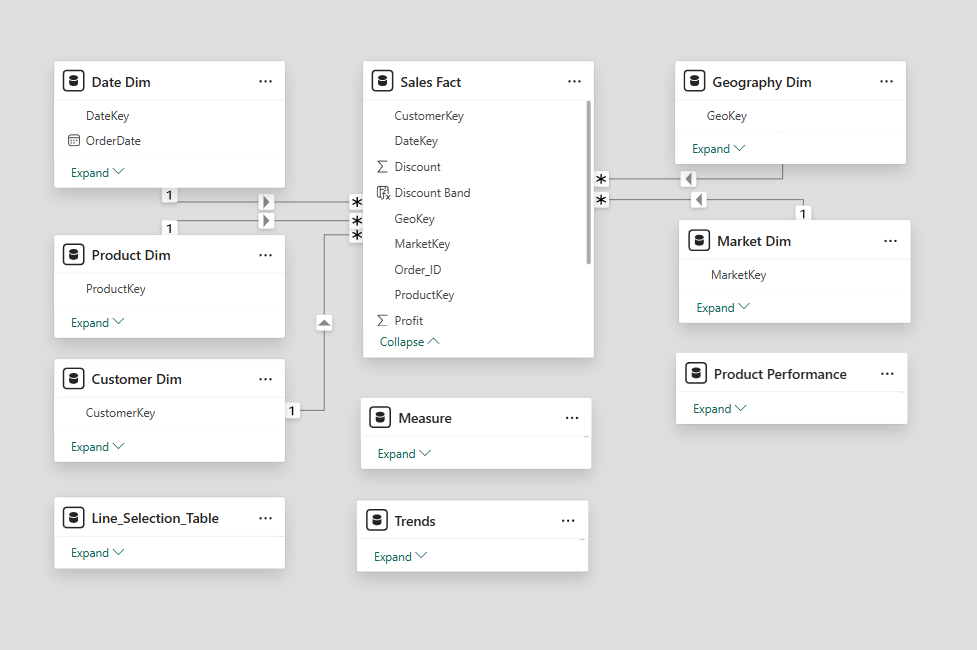
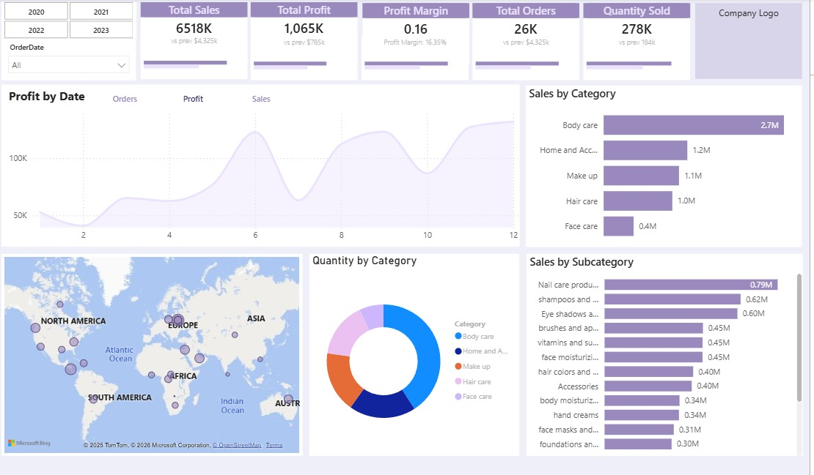
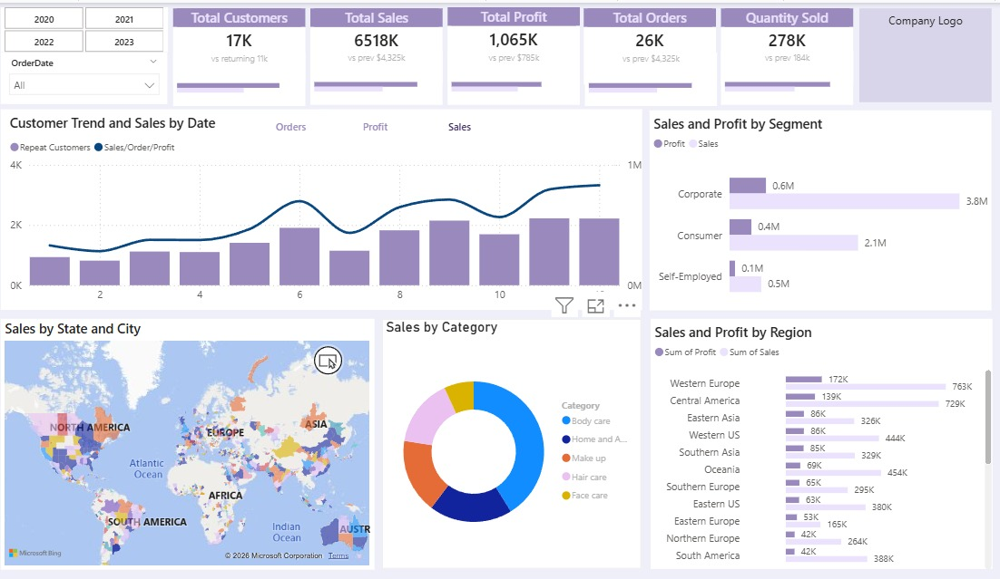
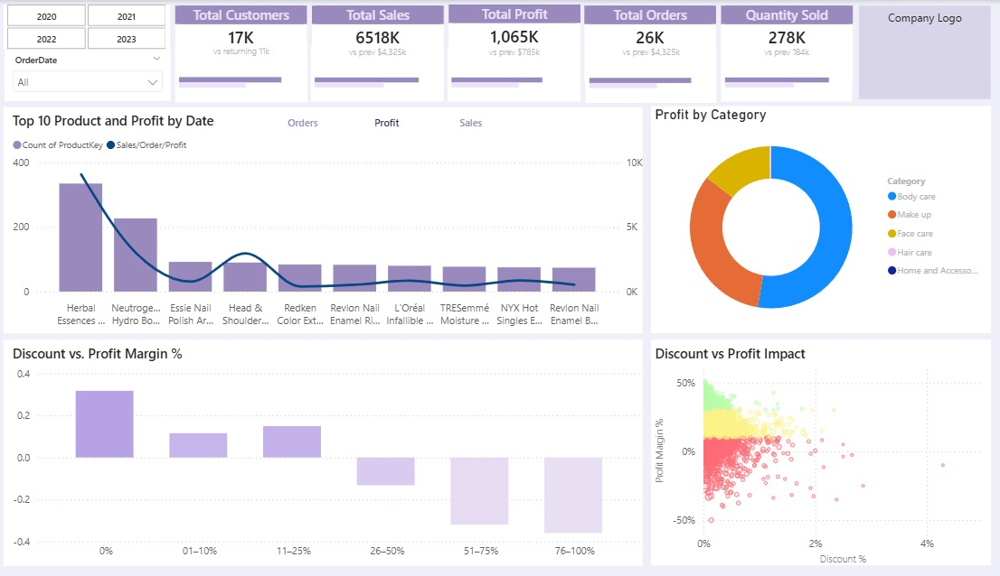

# E-Commerce Sales Analytics | Power BI

## Project Overview

This project analyzes e-commerce sales, customer, and product performance using Power BI.

The original dataset was provided in a single Excel worksheet. I used Power BI to model the data, create relationships, develop DAX measures, and build an interactive three-page dashboard.

The dataset was also loaded into SQL Server during project development for exploration and validation.

## Tools & Technologies
- Power BI
- DAX
- Excel
- Data Modeling
- Data Visualization
- SQL Server

## Data Model

The original Excel dataset contained the data in a single flat table.  
I created a structured Power BI data model by separating the data into fact and dimension tables and creating relationships using keys.

## Dashboard Pages

### 1. Overview
Provides a high-level view of business performance including:
- Total Sales
- Total Profit
- Total Customers
- Total Orders
- Quantity Sold
- Sales and profit trends
- 

### 2. Customer Market Analysis
Analyzes customer and market behavior to identify patterns and business opportunities.

### 3. Product Performance
Analyzes:
- Top products
- Product profitability
- Profit by category
- Discount vs. profit margin
- Impact of discounts on profitability

## Key Business Insight
The analysis shows how increasing discount levels can negatively affect profit margins, helping identify areas where discount strategies may need adjustment.

## Data Workflow
**Excel → Power BI Data Modeling → DAX → Business Analysis**
